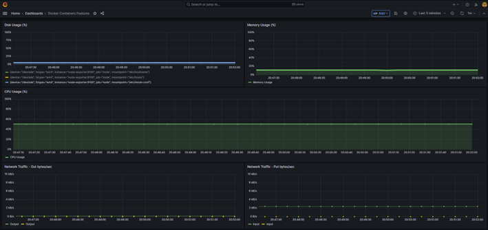

# 🚀 SRE Lab - Observabilidade com Prometheus e Grafana

Este projeto é um laboratório prático focado em **SRE (Site Reliability Engineering)**, com o objetivo de estudar monitoramento, observabilidade e simulação de cenários reais de produção.

---

# 🧠 Objetivo

Construir um ambiente local que simule um cenário real de infraestrutura, permitindo:

* Monitorar recursos do sistema
* Criar dashboards profissionais
* Configurar alertas
* Simular incidentes

---

# 🛠️ Tecnologias utilizadas

* Docker
* Prometheus
* Grafana
* Node Exporter
* WSL (Windows Subsystem for Linux)

---

# 📊 Métricas monitoradas

* 🔥 CPU
* 🧠 Memória
* 💾 Disco
* 🌐 Rede

---

# 🚀 Como executar o projeto

## 💻 Pré-requisitos

* Docker Desktop instalado
* WSL configurado

---

## ▶️ Subir o ambiente

```bash
docker compose up
```

---

## 🌐 Acessar serviços

* Grafana: http://localhost:3000
* Prometheus: http://localhost:9090

---

# 📈 Dashboards

O Grafana foi configurado para exibir:

* Uso de CPU em tempo real
* Consumo de memória
* Utilização de disco
* Tráfego de rede

---

# 🚨 Alertas

* Configuração de alertas baseada em métricas
* Exemplo: CPU acima de 80%

---

# 🧪 Simulação de carga (teste PRD)

## CPU

```bash
yes > /dev/null &
```

## Memória

```bash
tail /dev/zero
```

## Disco

```bash
dd if=/dev/zero of=teste.img bs=1M count=512
```

## Rede

```bash
ping google.com
```

---

# 💥 Simulação de incidente

Este laboratório permite simular cenários reais como:

* Alto uso de CPU
* Consumo elevado de memória
* Gargalo de disco
* Aumento de tráfego de rede

---

# 📚 Aprendizados

* Diferença entre monitoramento e observabilidade
* Criação de dashboards eficientes
* Definição de alertas inteligentes

---

## 📊 Dashboard - Recusros



---

# 👨‍💻 Autor

Guilherme Augusto

---

# ⭐ Contribuição

Sinta-se à vontade para contribuir ou sugerir melhorias!
